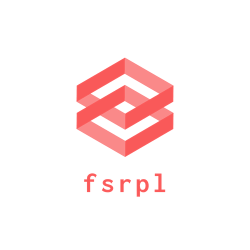

<p align="center"></p>

# fsrpl


English | [日本語](https://github.com/matsu0228/fsrpl/blob/master/README_ja.md)

fsrpl is CloudFirestore replication tool.

## Features

- `copy` Replicate document data from some node to another node. With Wildcard option, Replicate all document data from some collection node to another collection node.
  - In addition to this, replicate document data from some projectId's Firestore to another projectId's Firestore.
- `dump` Backup document data from some node to local JSON file.
- `restore` Restore document data from local JSON file. Because the data can be restored to the `firestore emulator` as well, it can be used to create test data.

Table Of Contents:
<!-- MarkdownTOC -->

- [fsrpl](#fsrpl)
  - [Features](#features)
  - [DEMO](#demo)
  - [SETUP](#setup)
    - [homebrew](#homebrew)
    - [go get](#go-get)
    - [Download](#download)
    - [Firestore private key](#firestore-private-key)
  - [USAGE](#usage)
    - [copy: copy some documents](#copy-copy-some-documents)
    - [dump: export data from some documents](#dump-export-data-from-some-documents)
    - [restore: import data from some JSON files](#restore-import-data-from-some-json-files)
    - [restore: import Data to firestore emulator](#restore-import-data-to-firestore-emulator)
    - [(for gopher) show Go struct from some document](#for-gopher-show-go-struct-from-some-document)
    <!-- /MarkdownTOC -->

## DEMO

| copy                                                 |
| ---------------------------------------------------- |
| <image width="600" src="assets/copy.gif" alt="copy"> |

| restore                                                    | dump                                                 |
| ---------------------------------------------------------- | ---------------------------------------------------- |
| <image width="400" src="assets/restore.gif" alt="restore"> | <image width="400" src="assets/dump.gif" alt="dump"> |

## SETUP

### homebrew

you can use `homebrew` for macOS

```
# add informal formula
brew tap matsu0228/homebrew-fsrpl

brew install fsrpl
```

### go get


```
go get github.com/matsu0228/fsrpl
```

### Download


download here to get binary.
https://github.com/matsu0228/fsrpl/releases


### Firestore private key

- you should set firestore's private key(JSON file).
  - you can get private key from console. see [official document](https://firebase.google.com/docs/admin/setup?authuser=0)
- You have two options.
  - set environment variable: `FSRPL_CREDENTIALS`
  - use `--cred` option

## USAGE

### copy: copy some documents

- copy some documents with `copy` sub command.

```
fsrpl copy [input document path] --dest [output document path]

e.g.

fsrpl copy "inputData/user" --dest "new/user"
fsrpl copy "inputData/*" --dest "outputData/*"
```

### dump: export data from some documents

- export data from some documents with `dump` sub command.

```
fsrpl dump [input document path] -f [json file directory path]

e.g.

fsrpl dump "inputData/user" --path ./
cat user.json
{
  "_created_at": "2019-08-26T05:00:00Z",
  "coin": 0,
  "favorites": [
    "1",
    "2"
  ],
  "isDeleted": true,
  "mapData": {
    "isMan": true,
    "name": "subName"
  },
  "name": "user"
}


fsrpl dump "inputData/*" --path ./

cat cat.json | jq
{
  "_created_at": "2019-08-26T05:00:00Z",
  "coin": 0,
  "favorites": [
    "1",
    "2"
  ],
  "isDeleted": true,
  "mapData": {
    "isBrownhair": true,
    "name": "calico"
  },
  "name": "cat"
}

cat dog.json | jq
{
  "name": "dog"
  ...
}
...

```


### restore: import data from some JSON files

- import data from JSON files with `restore` sub command.


```
fsrpl restore [import document path] --path [import JSON file directory path]

e.g.

fsrpl restore "importData/*" --path "./"

save to importData/ dog. data: map[string]interface {}{"_created_at":time.Time{wall:0x0, ext:63702392400, loc:(*time.Location)(nil)}, "coin":0, "favorites":[]interface {}{"1", "2"}, "isDeleted":true, "mapData":map[string]interface {}{"b":true, "name":"mName"}, "name":"pig"}
...
```


### restore: import Data to firestore emulator

- With setting the `FIRESTORE_EMULATOR_HOST` environment variable, the `restore` command can be used to restore the emulator.
  - The `--emulators-project-id` option allow to specify the projectId with to avoid data conflicts by specifying it.

```
FIRESTORE_EMULATOR_HOST=**your_firestore_emulator** fsrpl restore [import document path] --path [import JSON file directory path] --emulators-project-id [test unique Id]

e.g.

FIRESTORE_EMULATOR_HOST=localhost:8080 fsrpl restore "importData/*" --path "./" --emulators-project-id emulator-integration-test
```


### (for gopher) show Go struct from some document

- generate Go struct from some document with `-show-go-struct` option

```
e.g.

fsrpl dump "inputData/user" --show-go-struct

package main

type JsonStruct struct {
	CreatedAt string   `json:"_created_at"`
	Coin      int64    `json:"coin"`
	Favorites []string `json:"favorites"`
	IsDeleted bool     `json:"isDeleted"`
	MapData   struct {
		B    bool   `json:"b"`
		Name string `json:"name"`
	} `json:"mapData"`
	Name string `json:"name"`
}

```

